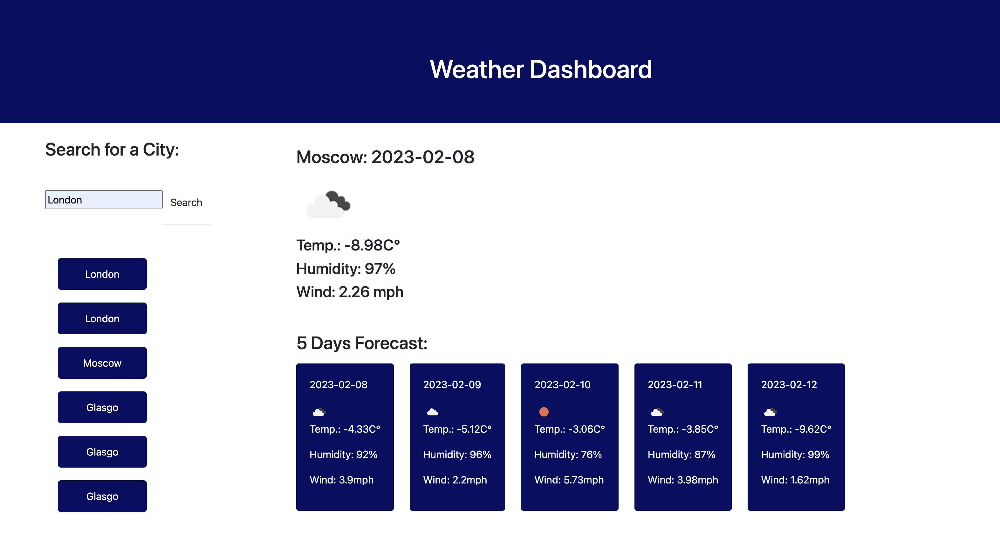

# Weather-dashboard
 
This repository contains a simple weather forecast dashboard app that runs in the browser and features dynamically updated HTML and CSS.

## Description

This application displays the 5-days weather forcast for a city chosen by a user, including City name, Date, Temperature, Humidity, Wind speed. The application stores the data of the last 6 searches in the local storage and retrieves this data aside in a form of buttons with the names of the cities.
 
## Installation
N/A

## Usage 
This webpage is deployed  at live URL, you can access it using: https://web3cryptoidea.github.io/weather-dashboard/

Deployed application screenshot:

 

## Credits

- Open Weather Map API [5 Day Weather Forecast](https://openweathermap.org/forecast5)
- Moment JS Library [Moment.js](https://momentjs.com/) 
- jQuery, a fast and feature-rich JavaScript library [jQuery] (https://jquery.com/)

## License
Please refer to the LICENSE in the repo.
